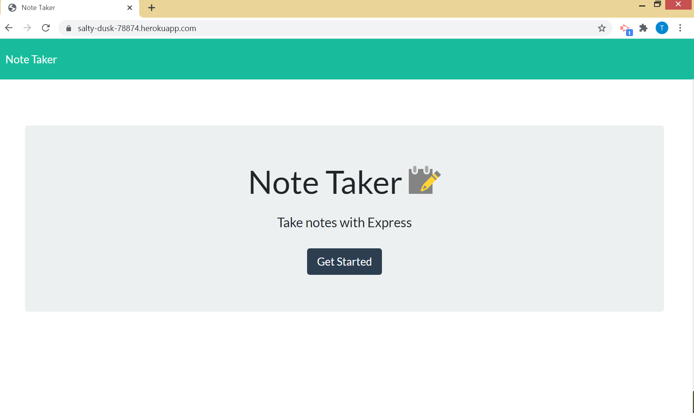
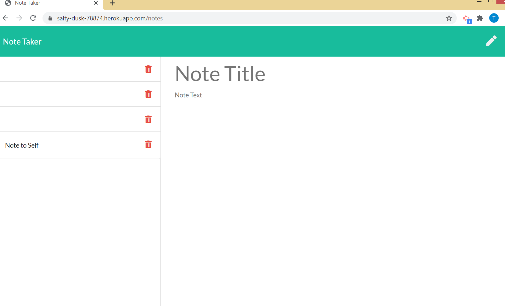

# Note Taker

## Description
The Note Taker is an app that allows the user to create and save notes.

[Link to deployed app](https://salty-dusk-78874.herokuapp.com/)
  
## Table of Contents
* [Installation](#installation)
* [Usage](#usage)
* [License](#license)
* [Contribution Guidelines](#contributing)
* [Questions](#questions)
 
## Installation
Clone repo and run "npm install".

## Usage
The app launches from an index.html page. Navigate to "./notes.html" to view any exisitng notes. Click on the pencil icon or in the text area to enter a note title and text. Once a title and text have been entered, a save button appears next to the pencil icon. Save the note and it will appear in the left column with the other notes.

[]

[]

## License
This project is licensed under a ISC License license. 

## Contributing
Contact Tracey through GitHub.

## Questions
Have additional questions? Contact [cjacktwil](http://github.com.cjacktwil) or email traceyjackson112@gmail.com.
